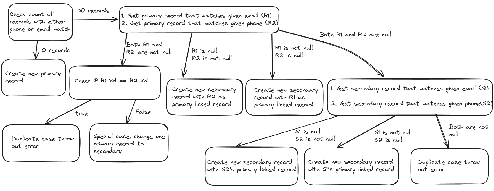

# Shopping App

### Made with Laravel PHP

- Routes are defined under [api.php](./routes/api.php)

- Business logic is defined under [IdentityController.php](./app/Http/Controllers/IdentityController.php)

### Connected to a Supabase instance (PostgreSQL database)

- Currently no checks are made for bad input, since it will increase overhead costs. This project assumes input checking will be done via a frontend framework.

- Added hash indexes on linkedId,phoneNumber and email for faster read operations.

- DB schema can be checked via the migrations used under [contact_migration](./database/migrations/2024_07_07_192849_create_contacts_table.php)

### Hosted on render.com

- Since Render.com does not offer native support for Laravel PHP, the application is containerized using Docker and Nginx to forward the Ports

- Can accept post requests on this [URL](https://shoppingapp-2ei4.onrender.com/api/identify);

- May respond a bit slow due to this setup as well as 512mb RAM :)

### Input type

Post contact requests using the following example

```json
{
    "phoneNumber":"6789319234",
    "email":"admin@gmail.com"
}

```

### Additional improvements made

- Adding to the problem statement it is also possible to chain secondary contacts
- Assume A is a primary contact with (x,y), B is a secondary contact with (x,z) then any new contact C with (z,k) will automatically be chained to A. 

## Workflow

- The logic for insertion of records is shown in the below diagram



- The logic for reading records is: Get corresponding primary record -> Get all rows having linkedId same as Id of primary record -> loop through them to get output -> Remove duplicate entries -> Get output.

